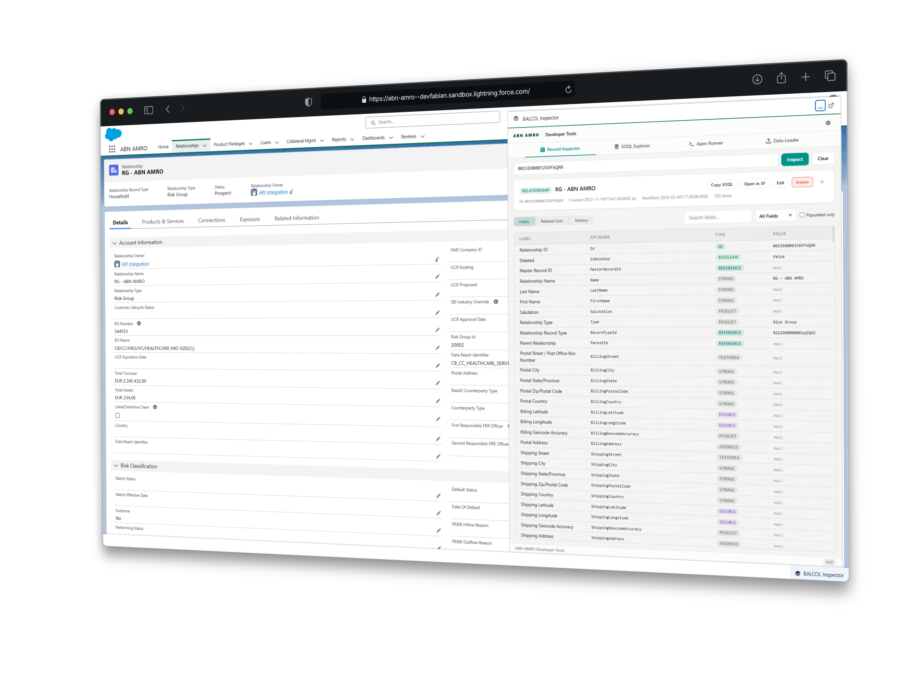

<div align="center">


<br><br>

# BALCOL Inspector

**Developer Tools for Salesforce**

A single Lightning Web Component that puts four powerful developer tools
directly inside your Salesforce org — zero external dependencies.

<br>

[](https://www.salesforce.com)
[](https://developer.salesforce.com/docs/atlas.en-us.api_rest.meta)
[]()
[]()

<br>

<a href="https://githubsfdeploy.herokuapp.com?owner=FabianACN2026&repo=abnamro-balcol-inspector&ref=main">
  
</a>

<br>



</div>

<br>

## What's Inside

<table>
<tr>
<td width="50%" valign="top">

### Record Inspector
Browse any record's fields, metadata, types, and values. Edit inline. Navigate related records and child relationships with multi-tab support.

</td>
<td width="50%" valign="top">

### SOQL Explorer
Write and execute SOQL with syntax highlighting, schema-aware autocomplete (up to 4-level relationships), cursor-based pagination, and inline editing.

</td>
</tr>
<tr>
<td width="50%" valign="top">

### Apex Runner
Execute anonymous Apex with syntax-highlighted output, automatic debug log parsing, and DML safety warnings before execution.

</td>
<td width="50%" valign="top">

### Data Loader
Bulk insert, update, upsert, and delete via CSV. Visual field mapping, batch processing with progress tracking, and detailed result reports.

</td>
</tr>
</table>

<br>

## Key Highlights

| | Feature | Detail |
|:---:|---|---|
| **0** | **Zero Installation** | Deploy via `sf` CLI — no npm, no external services, no setup overhead |
| **1** | **Single Component** | One LWC, 12 modules, 8 Apex controllers — everything in one place |
| **∞** | **No Row Limits** | Cursor-based REST pagination bypasses the 2,000-row OFFSET ceiling |
| **⚡** | **Smart Autocomplete** | Schema-aware SOQL suggestions with relationship traversal up to 4 levels deep |
| **✎** | **Inline Editing** | Edit field values directly in Record Inspector and SOQL query results |
| **🔒** | **Permission-Gated** | `Dev_Tools_Access` and `Dev_Tools_Power` custom permissions secure every action |

<br>

## Quick Start

```bash
# 1. Authenticate
sf org login web --alias myorg

# 2. Deploy
sf project deploy start \
  --source-dir force-app/main/default/classes \
  --source-dir force-app/main/default/lwc/devTools \
  --target-org myorg \
  --wait 10

# 3. Done — add the devTools component to any Lightning page
```

<details>
<summary><strong>Post-deployment checklist</strong></summary>

<br>

1. **Custom Permissions** — Create `Dev_Tools_Access` and `Dev_Tools_Power` in Setup → Custom Permissions
2. **Permission Sets** — Assign the permissions to the appropriate users
3. **Lightning Page** — Drag `devTools` onto any App Page via App Builder
4. **Remote Site** — Add your My Domain URL for cursor-based pagination (`SelfOrgCalloutHelper`)

</details>

<details>
<summary><strong>Scratch org deployment</strong></summary>

<br>

```bash
sf org create scratch \
  --definition-file config/project-scratch-def.json \
  --alias scratch-dev \
  --duration-days 30

sf project deploy start --target-org scratch-dev
sf org assign permset --name Dev_Tools_Access --target-org scratch-dev
```

</details>

<br>

## Architecture

```
force-app/main/default/
│
├── classes/                                  ← Apex Controllers
│   ├── RecordInspectorController.cls            Record field & metadata operations
│   ├── SOQLExplorerController.cls               SOQL execution & schema describe
│   ├── ApexRunnerController.cls                 Anonymous Apex & debug logs
│   ├── DataLoaderController.cls                 Bulk DML (insert/update/upsert/delete)
│   ├── MetadataBrowserController.cls            EntityDefinition object listing
│   ├── SecurityUtil.cls                         Permission enforcement
│   ├── SelfOrgCalloutHelper.cls                 REST callouts for cursor pagination
│   ├── DevToolsAccessController.cls             Access verification
│   └── *_Test.cls                               Test classes (8 total)
│
└── lwc/devTools/                             ← Lightning Web Component
    ├── devTools.js            2,200 lines       Main controller
    ├── devTools.html            988 lines       Template
    ├── devTools.css           1,700 lines       ABN AMRO dark theme
    ├── soqlTokenizer.js                         SOQL tokenizer + clause context
    ├── soqlAutocomplete.js                      Schema-aware autocomplete engine
    ├── soqlHighlighter.js                       Syntax highlighting renderer
    ├── historyManager.js                        Query & Apex history (localStorage)
    ├── preferencesManager.js                    User preferences (localStorage)
    ├── csvParser.js                             CSV parsing for Data Loader
    └── csvExporter.js                           CSV export for query results
```

<br>

<details>
<summary><strong>Client-side patterns</strong></summary>

<br>

| Pattern | Purpose |
|---|---|
| Overlay textarea | Transparent `<textarea>` over syntax-highlighted `<pre><code>` for SOQL editing |
| Schema cache | Client-side describe caching with pending fetch deduplication |
| Monotonic request IDs | Stale closure guard for 50ms debounced autocomplete |
| Spread reactivity | All array/object mutations via spread for LWC reactive tracking |
| CSS custom properties | Full theming via `--abn-*` design tokens |

</details>

<details>
<summary><strong>Server-side patterns</strong></summary>

<br>

| Pattern | Purpose |
|---|---|
| `@AuraEnabled(cacheable=true)` | Used wherever possible for Lightning Data Service caching |
| `SecurityUtil` checks | Every controller method validates permissions before execution |
| `SelfOrgCalloutHelper` | REST API callouts to same org for cursor-based SOQL pagination |
| Static `Pattern.compile` | Regex patterns compiled once as class constants |
| `LIMIT 1` existence checks | Child relationship queries capped for performance |

</details>

<br>

## Permissions

| Permission | Scope | Grants Access To |
|:---|:---|:---|
| `Dev_Tools_Access` | All users | Record Inspector, SOQL Explorer |
| `Dev_Tools_Power` | Power users | Apex Runner, Data Loader |

<br>

## Running Tests

```bash
sf apex run test \
  --target-org myorg \
  --test-level RunSpecifiedTests \
  --tests ApexRunnerController_Test \
  --tests DataLoaderController_Test \
  --tests RecordInspectorController_Test \
  --tests SOQLExplorerController_Test \
  --tests MetadataBrowserController_Test \
  --tests SecurityUtil_Test \
  --tests SelfOrgCalloutHelper_Test \
  --tests DevToolsAccessController_Test \
  --wait 10 \
  --result-format human
```

<br>

## Documentation

| | Document | What You'll Find |
|:---:|---|---|
| 📖 | **[Technical Documentation](docs/technical-documentation.html)** | Architecture deep-dive, API reference, implementation details |
| 🚀 | **[Quick Start Guide](docs/quick-start-guide.html)** | Step-by-step deployment and first-use walkthrough |
| 👋 | **[Onboarding](docs/onboarding.html)** | Interactive visual guide for new users |

<br>

---

<div align="center">

<sub>Built for <strong>ABN AMRO</strong> &nbsp;·&nbsp; BALCOL Inspector v1.0 &nbsp;·&nbsp; Salesforce Lightning</sub>

</div>
